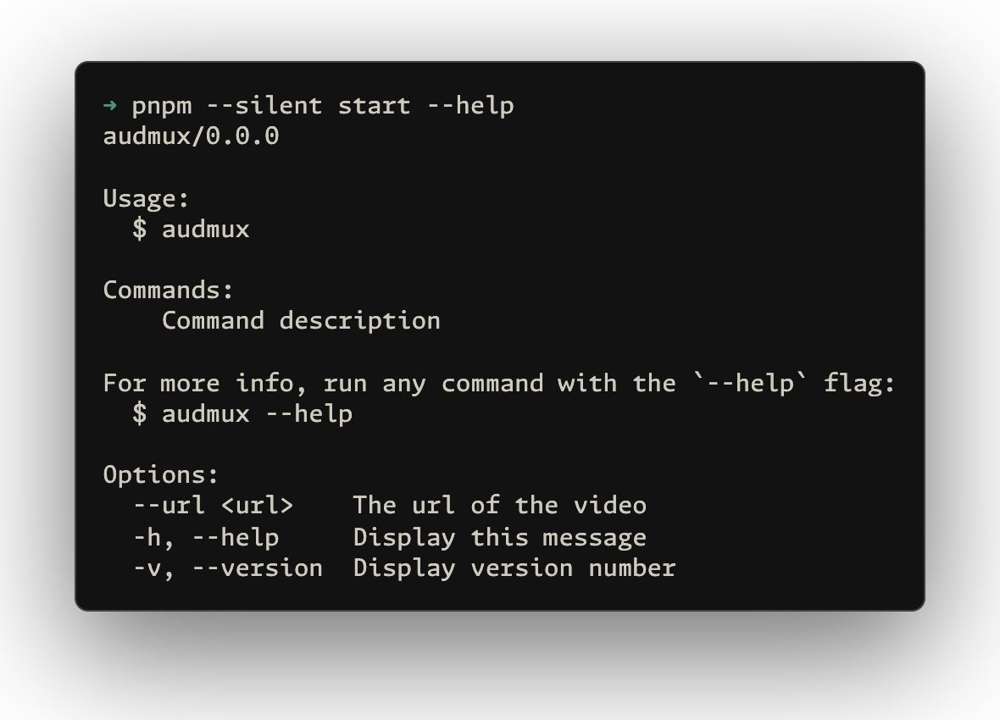

# audmux

[![npm version][npm-version-src]][npm-version-href]
[![License][license-src]][license-href]

> [!IMPORTANT]
>
> 🚧 **Please respect copyright. The extracted audio should NOT be used for commercial purposes or uploaded to other platforms without permission. This tool is intended for personal use only.**

Extract and remux audio streams from online video sources.

## Usage

```bash
npx audmux --url <url>
```

<p align='center'>

</p>

## Supported Platforms

- **[Bilibili](https://www.bilibili.com/)** - Extract audio from Bilibili videos

## Credit

This project is inspired by and uses concepts from [BilibiliVideoDownload](https://github.com/BilibiliVideoDownload/BilibiliVideoDownload).

## License

[MIT](./LICENSE) License © [jinghaihan](https://github.com/jinghaihan)

<!-- Badges -->

[npm-version-src]: https://img.shields.io/npm/v/audmux?style=flat&colorA=080f12&colorB=1fa669
[npm-version-href]: https://npmjs.com/package/audmux
[npm-downloads-src]: https://img.shields.io/npm/dm/audmux?style=flat&colorA=080f12&colorB=1fa669
[npm-downloads-href]: https://npmjs.com/package/audmux
[bundle-src]: https://img.shields.io/bundlephobia/minzip/audmux?style=flat&colorA=080f12&colorB=1fa669&label=minzip
[bundle-href]: https://bundlephobia.com/result?p=audmux
[license-src]: https://img.shields.io/badge/license-MIT-blue.svg?style=flat&colorA=080f12&colorB=1fa669
[license-href]: https://github.com/jinghaihan/audmux/LICENSE
[jsdocs-src]: https://img.shields.io/badge/jsdocs-reference-080f12?style=flat&colorA=080f12&colorB=1fa669
[jsdocs-href]: https://www.jsdocs.io/package/audmux
